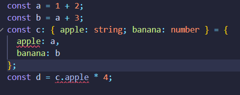

El error se produce porque en TypeScript definimos explícitamente el tipo de cada propiedad del objeto c. Especificamos que c.apple debe ser una cadena (string), pero le estamos asignando a, que es un número (number). Esta incompatibilidad entre el tipo esperado y el valor asignado causa un TypeError en TypeScript.

**1.Para cada uno de los valores del fichero code2.ts, ¿Qué tipo de datos inferirá TypeScript? Explica por qué se ha inferido este tipo de datos.**

- a: number - el valor asignado, 1042, es un número. Como TypeScript detecta el tipo en la asignación, no es necesario especificarlo explícitamente.
- b: string - TypeScript infiere string porque el valor asignado, 'apples and oranges', es una cadena de texto. TypeScript asigna automáticamente el tipo string a esta constant
- c: string - Similar al caso anterior, TypeScript detecta que el valor es una cadena de texto (string), por lo que infiere el tipo string.
- d: boolean[] - El valor es un array que contiene únicamente valores booleanos (true y false), así que TypeScript infiere el tipo como un array de booleanos (boolean[]).
- e: object - { type: string } - TypeScript infiere que e es un objeto con una propiedad type de tipo string debido a la cadena 'ficus'. TypeScript deduce que el tipo de la propiedad type es string en lugar de una cadena literal como 'ficus'.
- f: (number | boolean)[] - Como el array contiene dos tipos diferentes de datos (number y boolean), TypeScript infiere que el tipo de f es un array que acepta ambos tipos, representado como (number | boolean)[].
- g: number[] - El array contiene únicamente un número (3), así que TypeScript infiere que el tipo de g es number[] (array de números)
- h: null - null es considerado un tipo específico y no se infiere como otro tipo (como undefined o algún tipo de referencia).

Los valores inferidos son los tipos de datos que TypeScript puede inferir de los valores de los objetos, variables, etc. Esto se conoce como tipado estático.   

**2.¿Por qué se dispara cada uno de los errores del fichero code3.ts?**

- error 1: Aquí, i se define con el tipo literal 3, lo que significa que solo puede tomar el valor 3. Además, i es una constante (const), por lo que intentar asignarle otro valor como 4 generará un error.

- error 2: j es un array de números, inferido automáticamente como number[] debido a los valores [1, 2, 3]. La operación j.push(4) funciona porque 4 es un número. Sin embargo, j.push('5') produce un error, ya que '5' es una cadena (string), no un número

- error 3: El tipo never en TypeScript indica un valor que nunca debe ocurrir, normalmente usado en funciones que nunca devuelven un valor o terminan en errores. Al intentar asignar 4 a k, TypeScript genera un error porque 4 es un valor numérico válido, mientras que never implica ausencia de valor o situación imposible.

- error 4: l se declara con el tipo unknown, lo cual significa que TypeScript sabe que l tiene un valor, pero no conoce su tipo exacto. Para realizar operaciones aritméticas, TypeScript requiere saber el tipo exacto de l. Por lo tanto, en let m = l * 2, TypeScript lanza un error porque no puede confirmar si l es un número y si es compatible con la operación de multiplicación.

**3.¿Cuál es la diferencia entre una clase y una interface en TypeScript?**

Ambas se utilizan para definir la estructura de los objetos, pero tienen diferencias importantes en su funcionamiento y propósito.

Aquí tienes un resumen de las principales diferencias entre **clases** e **interfaces** en TypeScript:

| Característica                  | Clase                                       | Interfaz                                    |
|---------------------------------|---------------------------------------------|---------------------------------------------|
| **Propósito**                    | Definir estructura y lógica de objetos      | Definir estructura (sin lógica)            |
| **Instanciación**               | Sí, usando `new`                            | No                                          |
| **Implementación de lógica**    | Sí, incluye métodos y constructor           | No, solo define tipos                      |
| **Modificadores de acceso**     | `public`, `private`, `protected`            | No, todos son `public`                      |
| **Herencia**                    | Puede extender una clase                    | Puede extender múltiples interfaces         |
| **Uso**                         | Crear objetos con estado y comportamiento   | Definir contratos para objetos o clases    |

**Ventajas**:
-Clases: Permiten crear objetos reutilizables con datos y lógica controlada.
-Interfaces: Garantizan que las estructuras de los objetos sean consistentes, sin lógica de implementación.